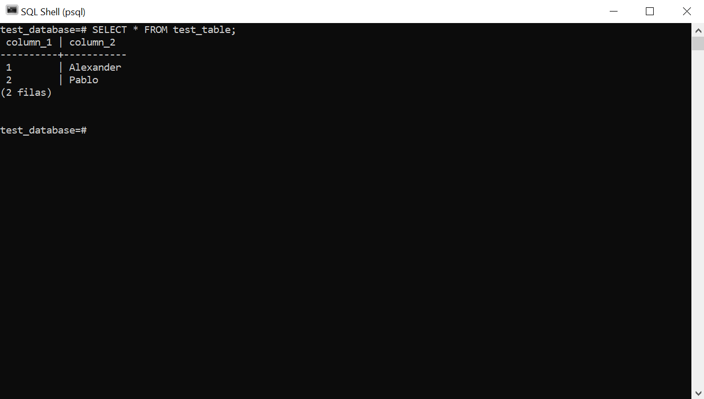
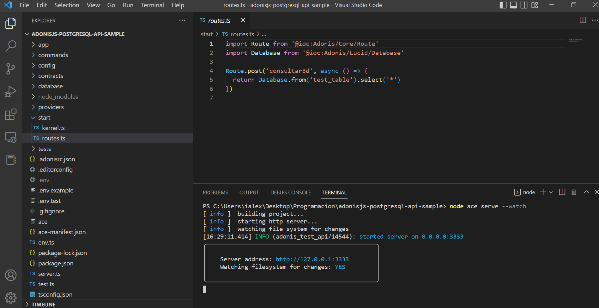
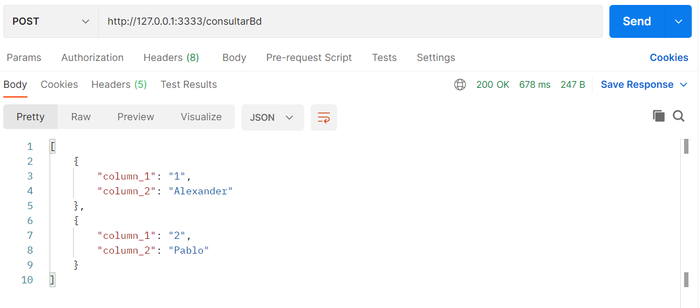

# adonisjs-postgresql-api-sample

Codificado por Alexander para Pablo 🚀

## Descripción
Ejemplo de implemenmtación de una API simple con **Adonis JS** mediante método POST, el cual ejecuta una consulta a una tabla de pruebas en **PostgreSQL**.

## Base de datos en PostgreSQL

## Función consultarBd y montaje del servidor local

## Consumiendo el servicio desde Postman

